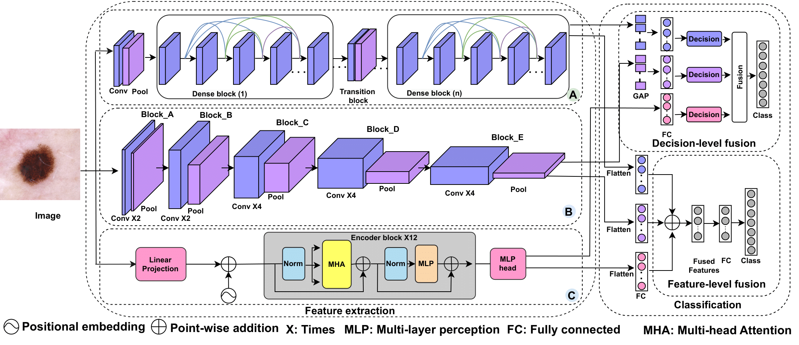

# Official Implementation of Feature-Level and Decision-Level Fusion for Skin Lesion Classification

This repository provides the official implementation of the paper:

**"Skin Disease Diagnosis using Decision and Feature Level Fusion of Deep Features"**  
*Authors: Md. Zasim Uddin, Md. Arif Shahriar, Björn W. Schuller, Md. Nadim Mahamood, Md Atiqur Rahman Ahad*

The project implements two fusion strategies—**feature-level fusion** and **decision-level fusion**—for skin lesion classification using deep learning models (VGG19, DenseNet201, and Vision Transformer) on the HAM10000, ISIC 2018 test data, PH2, and ISIC 2019 datasets. These strategies achieve enhanced performance through effective feature integration and ensemble techniques.

## Table of Contents
- [Overview](#overview)
- [Datasets](#datasets)
- [Models](#models)
  - [Feature-Level Fusion](#feature-level-fusion)
  - [Decision-Level Fusion](#decision-level-fusion)
- [Installation](#installation)
- [Usage](#usage)
  - [Preparing the Datasets](#preparing-the-datasets)
  - [Training Models](#training-models)
  - [Evaluating Models](#evaluating-models)
- [Results](#results)
- [Reproducibility](#reproducibility)
- [Citation](#citation)
- [License](#license)
- [Contact](#contact)

## Overview



This repository provides a comprehensive deep learning pipeline for skin lesion classification, comparing two fusion strategies:
- **Feature-Level Fusion**: Integrates deep features extracted from VGG19, DenseNet201, and Vision Transformer (ViT) within a unified model for early feature integration.
- **Decision-Level Fusion**: Combines predictions from individual VGG19, DenseNet201, and ViT models using weighted averaging or majority voting.

The pipeline supports data preprocessing, model training, evaluation, and visualization on benchmark datasets (HAM10000, ISIC 2018 test data, PH2, and ISIC 2019).

## Datasets
The project uses the following datasets:
- **HAM10000**: Available at [ISIC 2018 Challenge](https://challenge.isic-archive.com/data/#2018). Organize as:
  ```
  HAM10000/
  ├── actinic_keratoses/
  ├── basal_cell_carcinoma/
  ├── benign_keratosis_like_lesions/
  ├── dermatofibroma/
  ├── melanoma/
  ├── melanocytic_nevi/
  ├── vascular_lesions/
  ```
- **ISIC 2018 Test Data**: Available at [ISIC 2018 Challenge](https://challenge.isic-archive.com/data/#2018). Organize as:
  ```
  ISIC_2018/
  ├── test/
  │   ├── actinic_keratoses/
  │   ├── basal_cell_carcinoma/
  │   ├── benign_keratosis_like_lesions/
  │   ├── dermatofibroma/
  │   ├── melanoma/
  │   ├── melanocytic_nevi/
  │   ├── vascular_lesions/
  ```
- **PH2**: Available at [PH2 Database](https://www.fc.up.pt/addi/ph2%20database.html). Organize as:
  ```
  ph2_dataset/
  ├── atypical_nevi/
  ├── common_nevi/
  ├── melanoma/
  ```
- **ISIC 2019**: Available at [ISIC 2019 Challenge](https://challenge.isic-archive.com/data/#2019). Organize as:
  ```
  ISIC_2019/
  ├── actinic_keratoses/
  ├── basal_cell_carcinoma/
  ├── benign_keratosis/
  ├── dermatofibroma/
  ├── melanoma/
  ├── melanocytic_nevi/
  ├── squamous_cell_carcinoma/
  ├── vascular_lesions/
  ```

### Data Augmentation
- **GAN-Based Augmentation**: Uses StyleGAN2 ([NVlabs/stylegan2-ada-pytorch](https://github.com/NVlabs/stylegan2-ada-pytorch)) to generate synthetic images.
  1. Clone and install StyleGAN2:
     ```bash
     git clone https://github.com/NVlabs/stylegan2-ada-pytorch.git
     cd stylegan2-ada-pytorch
     pip install -r requirements.txt
     cd ..
     ```
  2. Preprocess images:
     ```bash
     python utils/process_data_for_stylegan2.py --input_dir /path/to/input --output_dir /path/to/preprocessed
     ```
  3. Prepare dataset:
     ```bash
     python stylegan2-ada-pytorch/dataset_tool.py --source=/path/to/preprocessed --dest=/path/to/dataset
     ```
  4. Train StyleGAN2:
     ```bash
     python stylegan2-ada-pytorch/train.py --outdir=results --data=/path/to/dataset --gpus=1 --cfg=auto --aug=ada --kimg=2000 --resume=ffhq256 --batch=32
     ```
  5. Generate synthetic data:
     ```bash
     python stylegan2-ada-pytorch/generate.py --outdir=/path/to/generated --trunc=1 --seeds=0-1000 --network=/path/to/checkpoint
     ```
- **ISIC Archive**: Additional data from [ISIC Gallery](https://gallery.isic-archive.com/#!/topWithHeader/onlyHeaderTop/gallery?filter=%5B%5D) is used for augmentation, organized by class.

### Data Splitting
- **HAM10000**: 80% training, 20% testing, with training data augmented using GAN and ISIC Archive.
- **ISIC 2018 Test Data**: HAM10000 used for training; ISIC 2018 test data for evaluation.
- **PH2**: Augmented using GAN and methods from [Benyahia et al. (2022)](https://doi.org/10.1016/j.tice.2021.101701). Split into five folds:
  ```bash
  python utils/augment_ph2.py --input_folder /path/to/input --output_folder /path/to/output --num_images 1000
  python utils/folding.py --root_dir /path/to/dataset --output_root /path/to/folds --num_folds 5 --seed 42
  ```
- **ISIC 2019**: 90% training, 10% testing, with training data augmented using GAN and ISIC Archive.

## Models
### Feature-Level Fusion
The feature-level fusion model integrates features from VGG19, DenseNet201, and ViT:
- **Inputs**: 224x224 RGB images.
- **Feature Extraction**:
  - VGG19: Convolutional features with global max pooling and dense projection (768 units).
  - DenseNet201: Similar feature extraction and projection.
  - ViT: Flattened transformer outputs.
- **Fusion**: Features summed, processed through a dense layer (512 units, ReLU, 0.5 dropout), and classified with softmax.
- **Checkpoint**: `fusion_checkpoint.hdf5`.

### Decision-Level Fusion
Combines predictions from individual models:
- **Models**:
  - VGG19: Pre-trained, fine-tuned with global max pooling, dense layers (512 units, 0.5 dropout), and softmax.
  - DenseNet201: Similar architecture.
  - ViT: Pre-trained ViT-B/16 with sigmoid activation, normalized for multi-class.
- **Fusion Strategies**:
  - **Weighted Averaging**: Combines probabilities (weights: 0.4, 0.3, 0.3 for VGG19, DenseNet201, ViT).
  - **Majority Voting**: Aggregates class predictions using `scipy.stats.mode`.
- **Checkpoints**: `vgg_checkpoint.hdf5`, `densenet_checkpoint.hdf5`, `vit_checkpoint.hdf5`.

## Installation
1. Clone the repository:
   ```bash
   git clone https://github.com/reyadhasan605/FLF-and-DLF-of-skin-disease.git
   cd FLF-and-DLF-of-skin-disease
   ```
2. Create a virtual environment:
   ```bash
   python -m venv env
   source env/bin/activate  # Linux/Mac
   env\Scripts\activate     # Windows
   ```
3. Install dependencies:
   ```bash
   pip install -r requirements.txt
   ```
4. GPU setup (optional):
   - Install CUDA 11.3 and cuDNN for GPU acceleration.
   - Ensure TensorFlow 2.11.1 compatibility with NVIDIA GPUs.

## Usage
### Preparing the Datasets
Organize datasets as specified in [Datasets](#datasets). Augment data using GAN or ISIC Archive as needed.

### Training Models
1. **Decision-Level Fusion**:
   ```bash
   python main.py --mode train --fusion decision --decision_method majority --train_dir /path/to/train --test_dir /path/to/test --vit_checkpoint /path/to/vit_model.h5 --vgg_checkpoint /path/to/vgg_model.h5 --densenet_checkpoint /path/to/densenet_model.h5
   ```
   Outputs: `vgg_checkpoint.hdf5`, `densenet_checkpoint.hdf5`, `vit_checkpoint.hdf5`.
2. **Feature-Level Fusion**:
   ```bash
   python main.py --mode train --fusion feature --train_dir /path/to/train --test_dir /path/to/test --feature_checkpoint /path/to/feature_fusion_model.h5
   ```
   Output: `fusion_checkpoint.hdf5`.

### Evaluating Models
1. **Decision-Level Fusion**:
   ```bash
   python main.py --mode test --fusion decision --decision_method majority --test_dir /path/to/test --vit_checkpoint /path/to/vit_model.h5 --vgg_checkpoint /path/to/vgg_model.h5 --densenet_checkpoint /path/to/densenet_model.h5
   ```
2. **Feature-Level Fusion**:
   ```bash
   python main.py --mode test --fusion feature --test_dir /path/to/test --feature_checkpoint /path/to/feature_fusion_model.h5
   ```


## Results
To reproduce results, download datasets and checkpoints from [Google Drive](https://drive.google.com/drive/folders/1j9bsPmoJTaPMQytaKNG7_iF-eyLj3r3R?usp=sharing).

## Reproducibility
For reproducible results:
1. Use dependencies from `requirements.txt`.
2. Organize datasets as specified.
3. Use provided checkpoints or train with `main.py`.
4. Set random seeds: `tf.random.set_seed(42)`, `np.random.seed(42)`.
5. For PH2, augment data due to its small size (~50-100 images) to reduce metric variability.

Tested with TensorFlow 2.11.1 on a GPU-enabled environment (CUDA 11.3).

## Citation
If you use this code or find our work useful, please cite:
```
```

## License
The codes and checkpoints in this repository are under the [CC BY-NC-SA 4.0](https://creativecommons.org/licenses/by-nc-sa/4.0/legalcode) license.

## Contact
For questions or feedback, please contact [reyadhasan605@gmail.com](mailto:reyadhasan605@gmail.com).

Contributions are welcome to enhance this implementation.